# TP:1 Installation Linux et mise en reseau


## 2) Gestion des applications


1) Vérifier que les dépôts logiciels Debian sont bien configurés dans le fichier /etc/apt/sources.list

### COMMANDES

```
cat /etc/apt/sources.list
```
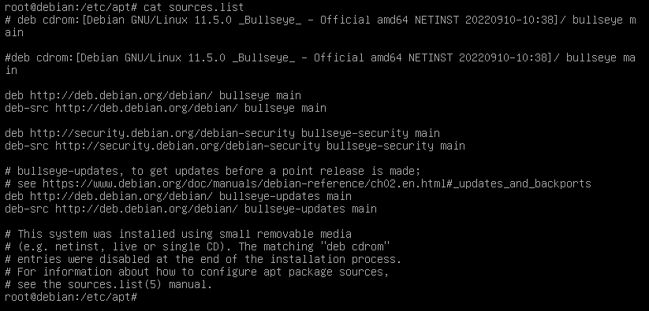

2.1) Mettre à jour la base de données locales depuis les dépôts

### COMMANDE
```
 apt-get update
```
2-2) Afficher la liste complète des paquets Debian installés sur le sytème. Combien y en a-t-il ?

### COMMANDE

```
apt list
```
J'ai copié l'output de la list des paquets dans un fichier *list.txt* avec la commande ci-dessous et ensuite j'ai utlisé une autre commande pour compter le nombre de ligne, soit le nombre de paquets et le resultat est 58719 paquets.

```
apt list > list.txt
wc -l list.txt
```
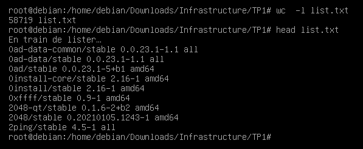

2-3) Installer l'outil de capture réseau tcpdump sur votre VM

### COMMANDE

```
apt-get install tcpdump
```
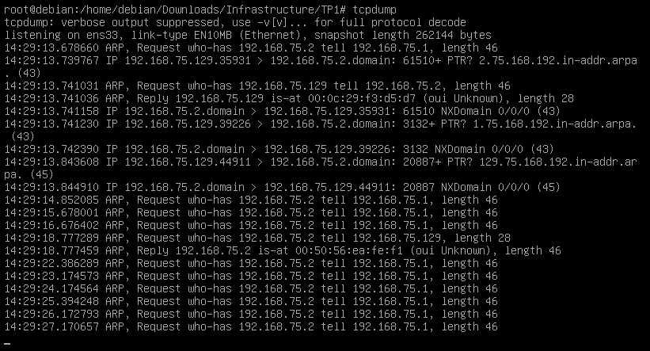

2-4) Vérifier que tcpdump s'est bien installé

### COMMANDE

```
tcpdump --version
```
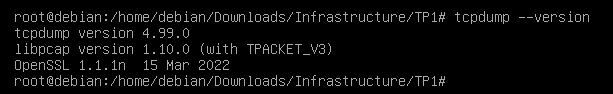

2-5) Afficher les informations concernantle paquet tcpdump

### COMMANDES

```
apt show tcpdump
```
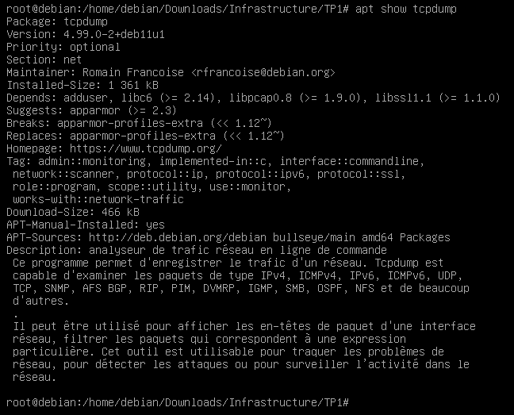

2-6) Lister les fichiers appartenant au paquet tcpdump

### COMMANDE

```
dpkg -L tcpdump
```
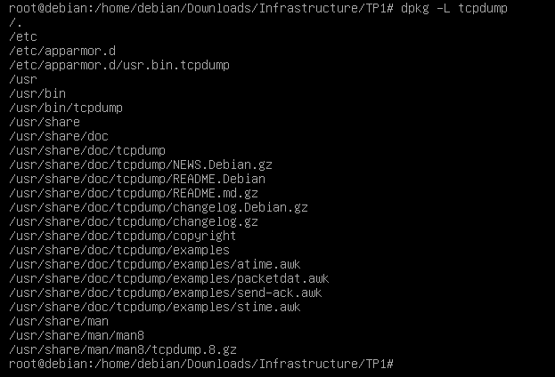

2-7) De quel paquets Debian provient le fichier /etc/services ?

### COMMANDES

```
dpkg -S /etc/services
```
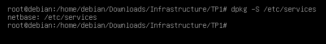


## 3) Configuration carte reseau


1-a) Afficher les adresses IP et les masques réseau de vos cartes réseau actives

### COMMANDES

```
ip addr
```

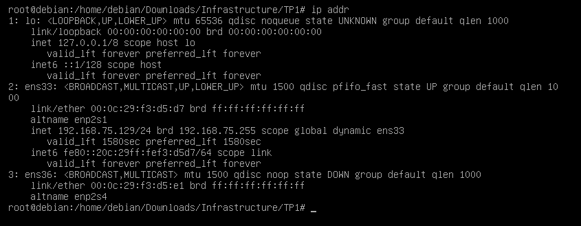

1-b) Afficher les adresses IP et les masques réseau sous forme abrégée et colorée

### COMMANDES

```
ip -br -c addr
```

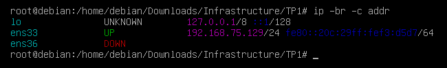

1-c) Afficher les adresses IP version 4 (IPV4) uniquement et les masque réseau sous forme abrégée et colorée

### COMMANDES

```
ip -4 -br -c addr
```

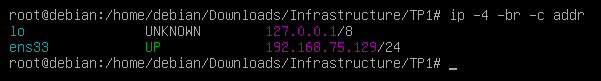

1-d) Afficher l'adresse MAC. Peut-on la changer ?

- Oui on peut changer l'adresses Mac avec la commande

### COMMANDES

```
ip link show

ip link show 'interface'
ip link set dev 'interface' down
ip link set dev 'interface' address 'new address mac'
ip link set dev 'interface' up
ip link show 'interface'

```
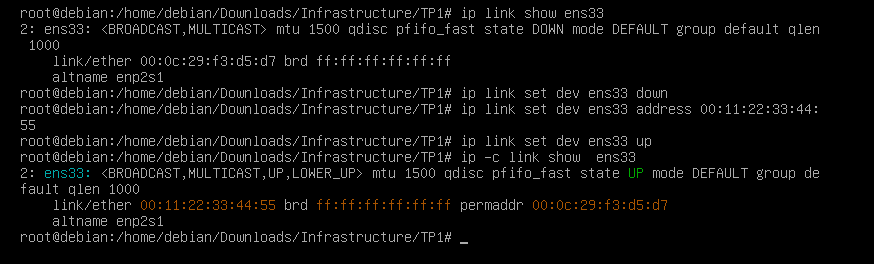

1-e) Affichez les tables de routage (et donc l'adresse de la passerelle par défault)

### COMMANDES

```
ip -c route
```
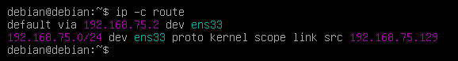

1-f) Quelles est le résultat de la commande *ip link show enp0s3*

### COMMANDES

- Je n'ai pas l'interface 'enp0s3', mais c'est l'equivalent de mon interface 'ens33'

```
ip link show ens33
```
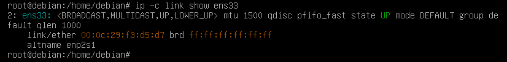


2) Affichez la connectivté d'une carte Ethernet avec le switch ethernet

### COMMANDES

```
sudo ethtool ens33
```

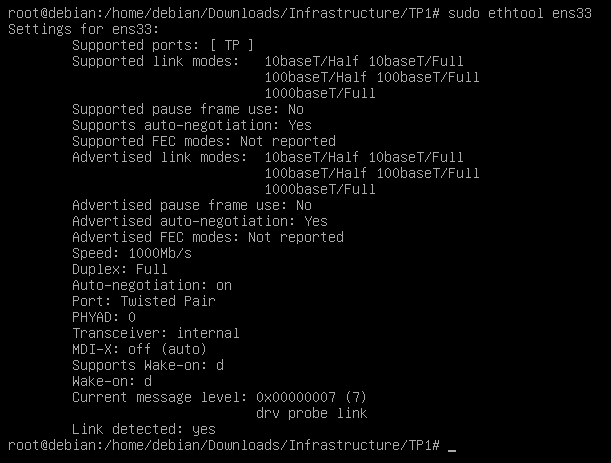

3) Affichez la liste des passerelles traversées pour atteindre un systéme distant

### COMMANDES

```
traceroute google.com
```
- On peut voir qu'il faut 30 saut (hop) avant que j'atteigne le serveur distant de google.com
mais on peut voir les "***" qui s'affiche, cela peut signifier que le serveur a été configuré pour ne pas renvoyer de paquet icmp ou bien que le TTL(TIME TO LIVE) du paquet soit arrivé à expiration

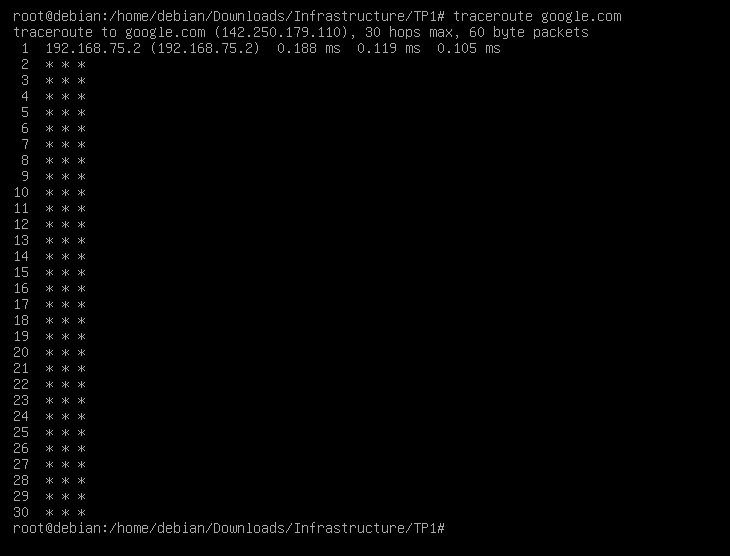

4-1) Affichez la configuration réseau traditionnelle d'un système Debian

### COMMANDES

```
cat /etc/network/interfaces
```
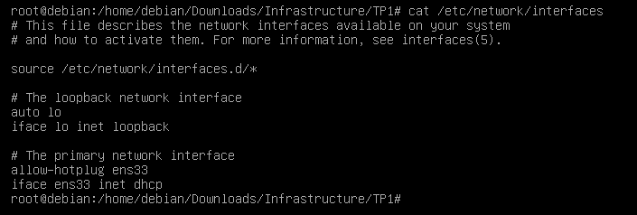


4-2) Assurez-vous que votre deuxième carte réseau 'enp0s8' (Pour moi l'équivalent c'est la carte 'ens36') est configurer sur virtualbox/vmware en réseau privé hôte(host-only)

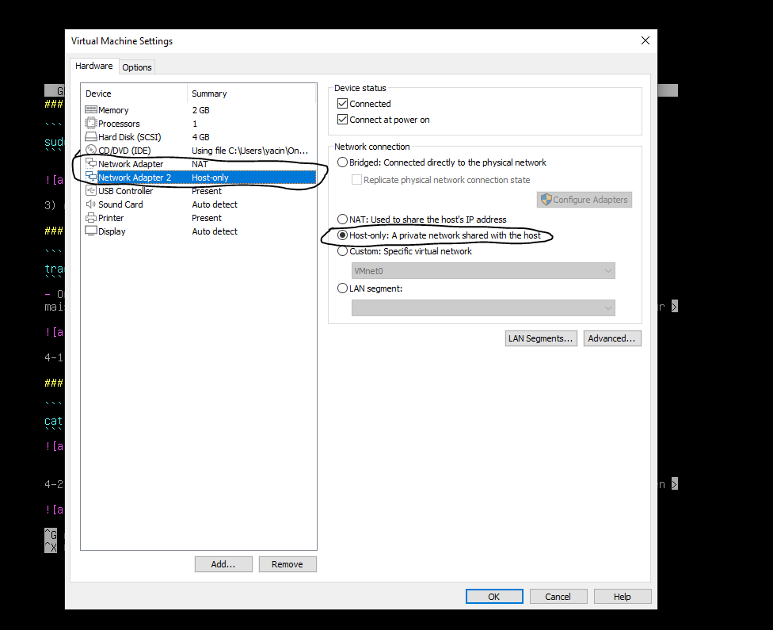

4-3) Rajouter dans /etc/network/interfaces les lignes de configuration de la carte 'enp0s8' (Pour moi ens36) en static puis sauvegarder le fichier

### COMMANDES

```
nano /etc/network/interfaces
```
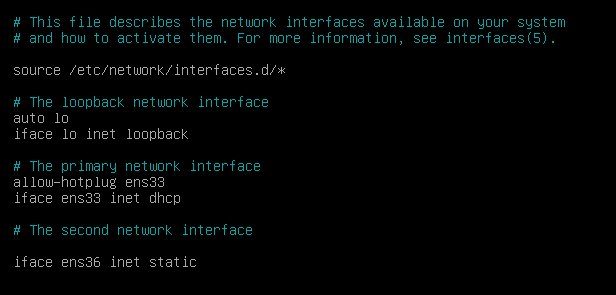

4-4) Redèmarrer le service networking : systemctl restart networking

### COMMANDES

```
systemctl restart networking
systemctl status networking
```
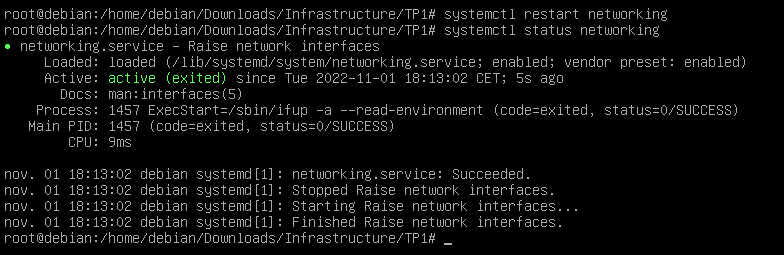

4-5) Vérifier que la nouvelle adresse est prise en compte

### COMMANDES

```
ip -c addr && ip -c link
```
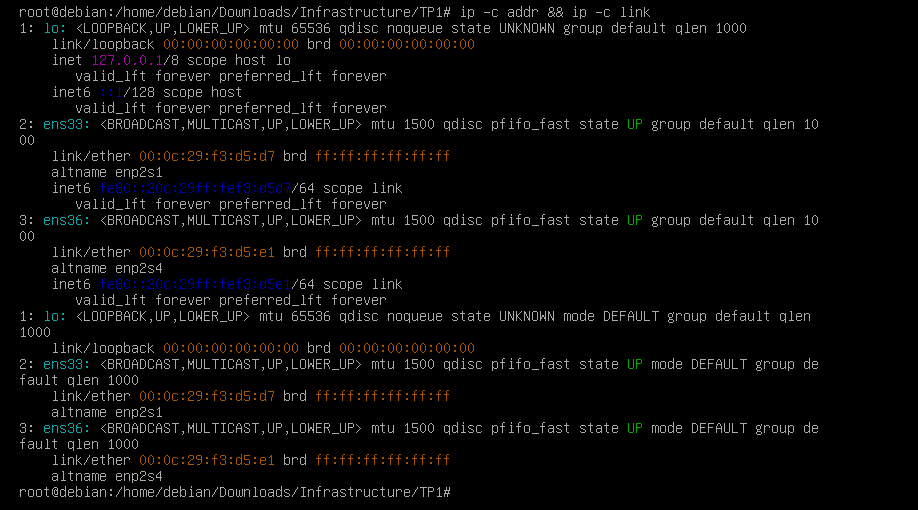

4-6) A partir de votre machine hôte, pinguer votre VM. Le ping doit réussir, sinon dépanner votre configuration

### COMMANDES DEPUIS MA MACHINE HÔTE

```
ping -n 1 192.168.136.1
ping -n 1 192.167.75.1
```
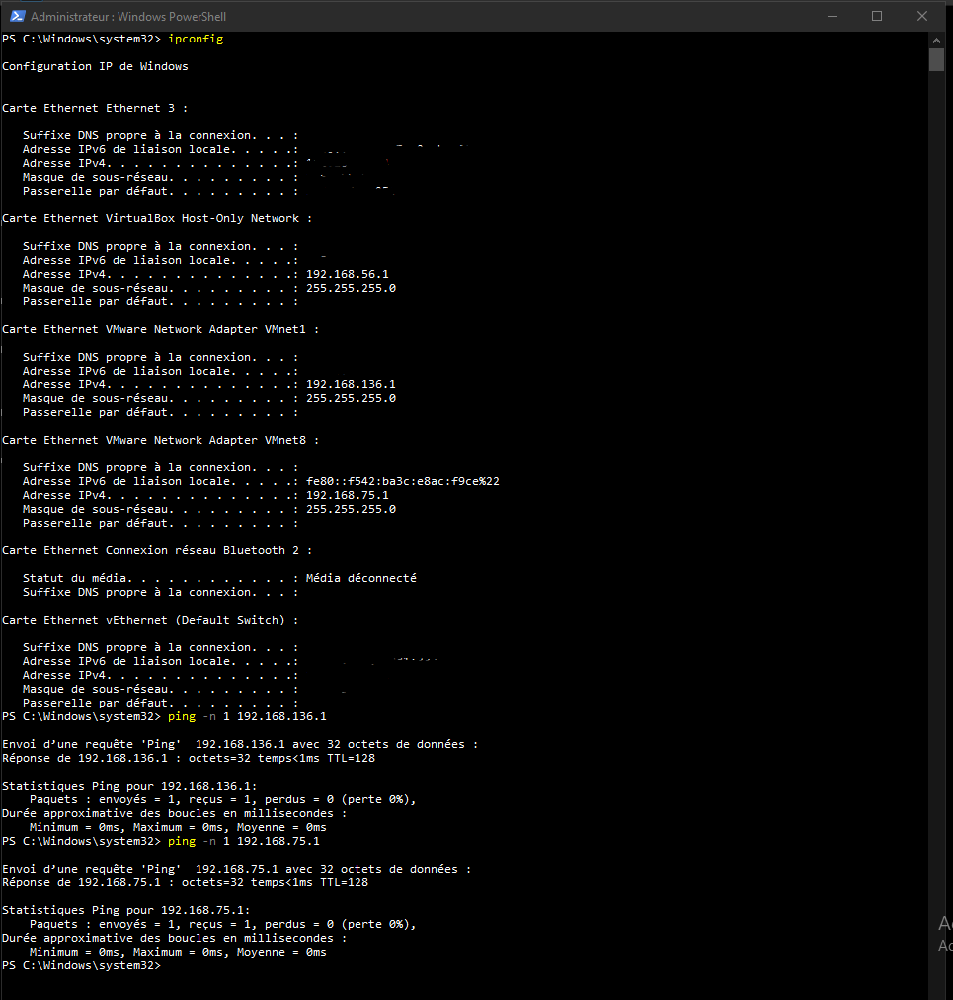